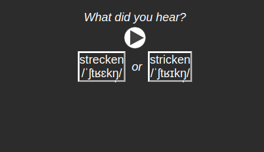
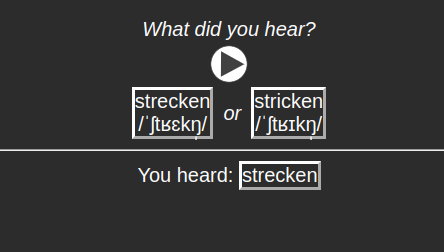

# Anki integration

After you've [found a satisfying number of minimal pairs](./minimal-pairs.md),
you may create [an Anki](https//apps.ankiweb.net) deck with them as flashcards.

You can use the `makedeck` subcommand to do just that. If your minimal pairs
file is called `minpairs.json`, and you wanted to put the Anki deck package file
at `anki-minpairs.apkg`, then you'd simply run:

```
makedeck minpairs.json anki-minpairs.apkg
```

Unfortunately, **the flashcards have no audio**. This is not because I haven't
gotten to doing it, but because there is a complete lack of free (as in beer)
APIs or libraries that can (legally) furnish audio pronunciations. Forvo, which
is in my opinion one of the best platforms for audio pronunciations, has an API,
but it is paid. You must, therefore, add the audio yourself.

### Importing the deck into Anki

After you've created a deck package, open Anki, click on `Files` in the top left
corner, then `Import`, and then find the file and load it. A new deck,
"grzegorz's minimal pairs", should pop up. You can rename it, you can move it,
you can do anything with it. You also have control over its options, i.e. how
often you review it and whatnot.

### What the flashcards look like

The flashcards are fairly straightforward. There are two cards per note, and
every note corresponds to a minimal pair. In each flashcard you are given a
pronunciation and a simple choice between the two words in the minimal pair.

Here's an example with a flashcard's front side:



And the back side:


